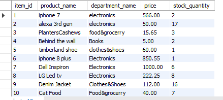
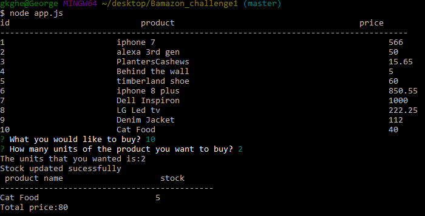
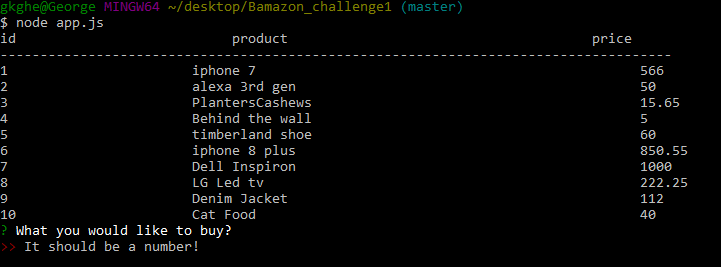
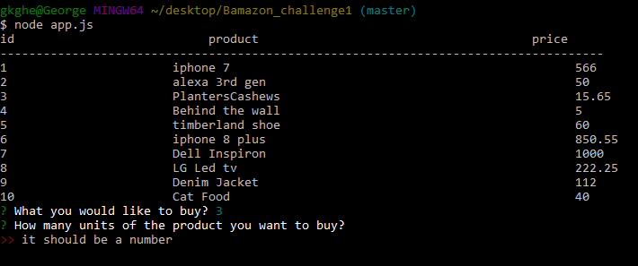
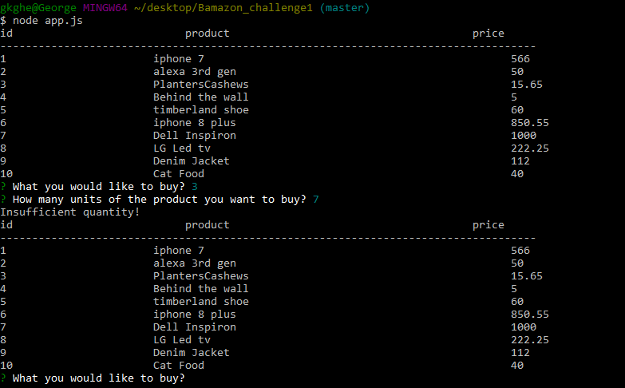

# Bamazon_challenge1
*It is a node application used for e-commerce.There are mainly four functions on this program.The back end is **mysql**.
*It works on the command line.
*The packages used-**mysql,inquirer**.
##Mysql-database
*database-**bamazon**
*Table-**products**.There are four columns in the table **item_id,product_name,department_name,price,stock_quantity**.item_id is a primary key with auto increment*.
###function start
*First it displays all the items in the table products.Then the user has to answer for two questions in the command line.First one is *** The ID of the product they would like to buy and the second one is how many units of the product they would like to buy**.
*Two validation functions are used inside inquirer because the answers for the questions should be a number.So it accepts only numbers.*
*It calls the process function*
####function process
*In this function it checks the stock quantity for the item that the user want to buy.If the stock is less than the number of units the user enterd the it displays **insufficient quantity**,and it automatically calls the start function.
*Otherwise it calculates the remaining stock and calls the update function*
#####function update
*Within this function it executes the update query and update the database with current stock quantity.
*It displays a message **updated sucessfully**.
*it calls the calculate function*
######function calculate
*It selects the price for one unit from the databse and calculate the total price .
#######Screenshots
**Image-products table data
 
**Image-Displays a transaction and the total cost of the item.**

**Image-Validation for the two inquirer questions**

**Image-Insufficient quantity and it returns in to the main function and displays the data again**

